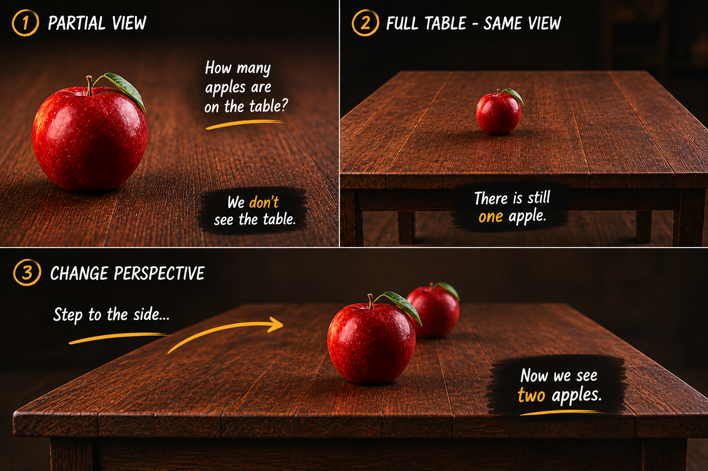

There is an apple on a table. How many apples are on the table?

Most people would answer: one. A more careful person might pause and say, “we can't see the whole table.” Part of it is hidden, so the honest answer is that we do not know.

That response feels intelligent because it is. It recognizes uncertainty instead of pretending certainty.

So we reveal the whole table.

Now we see the edges. The full surface. The same apple still sits there alone. We gathered more information, reduced uncertainty, and reached the same conclusion: *“there is one apple.”*

Then we take one step to the side. A second apple appears.

Not because we collected more data, but because we changed the perspective.

## Known unknowns and unknown unknowns

The first image with the apple contained a **known unknown**. We knew something was missing because part of the table was hidden. Once the whole table was revealed, we thought the uncertainty was gone — but it wasn't.

The second apple was an **unknown unknown**: something we did not know, and something we did not even know to look for.

That is what makes unknown unknowns dangerous. They rarely feel like gaps in our understanding. They feel like completeness.

## The instinct to gather more

When we face uncertainty, our instinct is almost always the same:

- Gather more information.
- Zoom out.
- Collect more data.
- Analyze harder.

Sometimes that works. But sometimes all we do is strengthen our confidence in the same answer. In the apple example, zooming out changed nothing. We saw more of the same view and reached the same conclusion with greater certainty: "one apple".

This happens everywhere. Companies collect larger datasets but ask the same questions. Teams create more reports built on the same assumptions. People consume more information from the same sources.

> More information can improve confidence without improving understanding.
> Those are not the same thing.

## Seeing differently

The second apple appeared only because we stepped sideways. Understanding came not from seeing more, but from seeing differently.

That sideways step can take many forms: asking someone outside your field, listening to someone who disagrees, changing the metric, questioning assumptions, or borrowing another person's perspective.

Someone else may already be standing where you are not. They can see the second apple.

## Perspective, and process

Perhaps there is an even broader lesson here. Perspective is not the only thing that can change outcomes. Process can too.

If your process is simply *observe → gather more information → conclude*, you may keep arriving at the same answer: one apple. But if you change the process — challenge assumptions, test another angle, invite disagreement — different details become visible.

Sometimes you need more information. Sometimes you should zoom out. But sometimes the better question is not *How can I see more?*

It is:

> *From where else could I look?*

Because somewhere just outside your current view sits the second apple.

